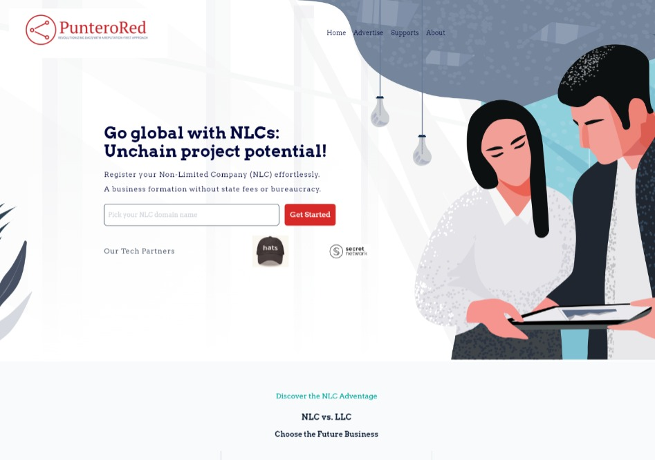

# Puntero Red 
The PunteroRed homepage is developed with React. In this case, I had the responsibility to redo the layout of the website to make it fully responsive and improve some aspects of performance. 

## Table of contents

- [Puntero Red](#puntero-red)
  - [Table of contents](#table-of-contents)
  - [Overview](#overview)
    - [Screenshots](#screenshots)
  - [Website live](#website-live)
  - [My process](#my-process)
  - [Author](#author)

# Overview
## Screenshots

Desktop Version

Mobile Version

# [Website live](https://puntero-red.vercel.app/)
## My process

React + TailwindCSS was used for the development of this website. The approach was to work using reusable components in the website to take advantage of working with a framework like React. 

## Author

- Email: [cesararaujo.perez@gmail.com](mailto:cesararaujo.perez@gmail.com)
- Fiverr: [@araujo\_](https://www.fiverr.com/araujo_)
- Upwork: [César Araujo](https://www.upwork.com/freelancers/~0131c3e9d8794f3c24)
